<div align="center">


# Join – Dateiupload

**IHK-Abschlussprojekt · Kanban-Projektmanagement mit Bild-Upload, Bildbetrachter und Gastmodus**

[](https://alexander-lindt.developerakademie.net/Join-IHK/)


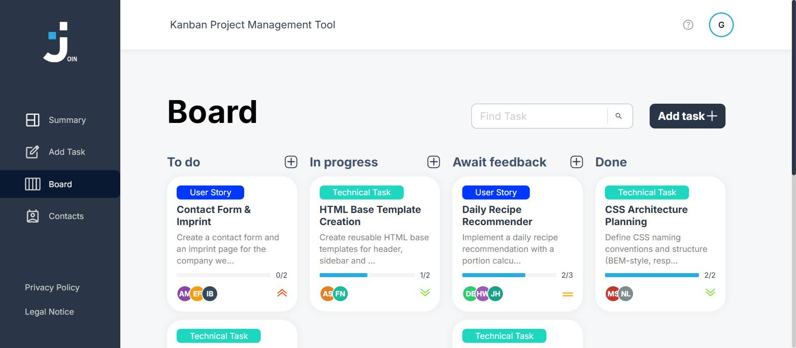

</div>

---

## Inhalt

- [Über das Projekt](#über-das-projekt)
- [Prüfungsfeature: Dateiupload](#prüfungsfeature-dateiupload)
- [Weitere Funktionen](#weitere-funktionen)
- [Screenshots](#screenshots)
- [Technik & Architektur](#technik--architektur)
- [Installation](#installation)
- [Code-Qualität](#code-qualität)
- [Autor](#autor)

---

## Über das Projekt

**Join** ist ein Kanban-Board für kleine Teams: Aufgaben anlegen, Kontakten zuweisen, per Drag & Drop durch die Spalten *To do → In progress → Await feedback → Done* schieben und den Fortschritt in der Übersicht verfolgen.

Im Rahmen der IHK-Abschlussprüfung wurde Join um einen vollständigen **Dateiupload für Bilder** erweitert – vom Filepicker über Validierung, Kompression und Base64-Speicherung bis zum Bildbetrachter. Umgesetzt nach dem Figma-Design *„Join Version IHK“*.

> **Selbst ausprobieren:** [Live-Demo öffnen](https://alexander-lindt.developerakademie.net/Join-IHK/) → **Guest Log in**.
> Gäste können alles nutzen; nach 15 Minuten, beim Logout oder beim Schließen der Seite wird alles zurückgesetzt.

---

## Prüfungsfeature: Dateiupload

<table>
<tr>
<td width="50%">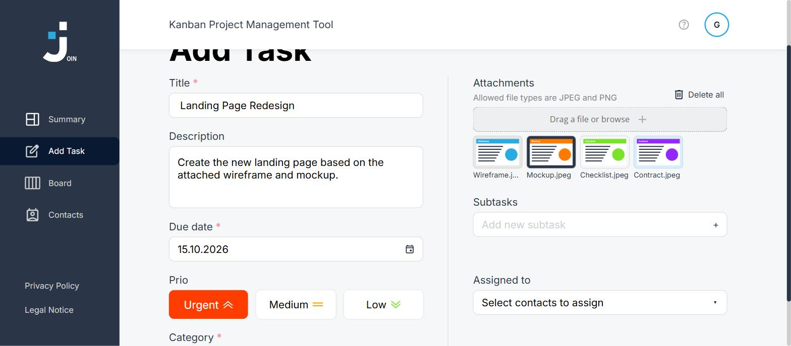</td>
<td width="50%">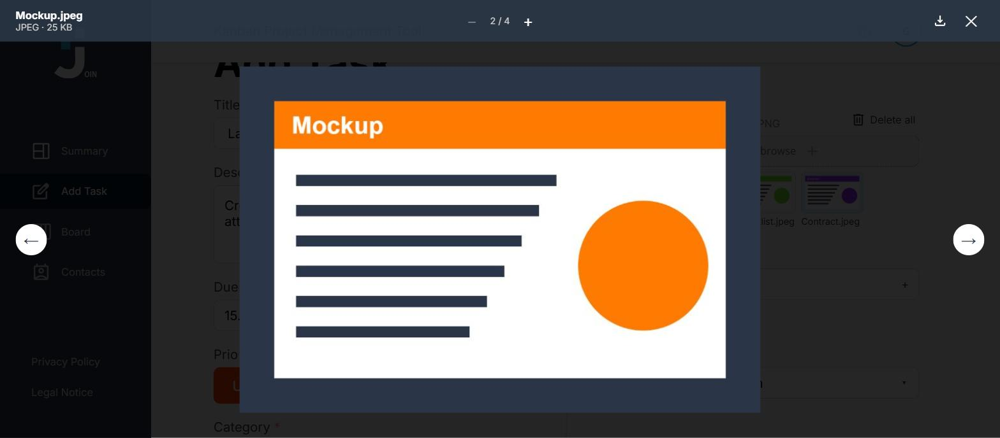</td>
</tr>
<tr>
<td align="center"><sub>Filepicker mit Vorschau, einzeln löschen oder „Delete all“</sub></td>
<td align="center"><sub>Bildbetrachter mit Blättern, Zoom und Download</sub></td>
</tr>
</table>

### Funktionsumfang

| Bereich | Umsetzung |
|---|---|
| **Hochladen** | Filepicker in *Add Task*, im Add-Task-Dialog des Boards und im Bearbeiten-Dialog – per Klick, Tastatur oder Drag & Drop, mehrere Dateien auf einmal |
| **Formate** | Nur **JPEG und PNG** – geprüft über `accept`, MIME-Typ, Dateiendung **und Dateisignatur (Magic Bytes)**; eine umbenannte `.txt` wird erkannt |
| **Upload-Limit** | Max. **1 MB Bilder pro Task** (Firebase-Limit); Warnung mit Balken, wie viel Platz schon belegt ist |
| **Kompression** | Automatisch auf max. **800 × 800 px** (Canvas); JPEG mit Qualität 0.8, PNG verlustfrei für Transparenz |
| **Speicherung** | Als Array im Task: `attachments: [{ name, type, size, base64 }]` |
| **Vorschau** | Vorschaubilder in *Add Task*, im Bearbeiten-Dialog und in der Task-Detailansicht |
| **Bildbetrachter** | Blättern (Pfeile & Pfeiltasten), Zoom, Download, Anzeige von **Name, Typ und Größe** |
| **Download** | Im Bildbetrachter und direkt in der Detailansicht |
| **Barrierefreiheit** | Drop-Zone ist ein Button mit Beschreibung, Fokusrahmen, ARIA-Labels, Fehler per `role="alert"` |
| **Responsive** | Getestet von 320 px bis 1440 px, Vorschauen scrollen in ihrer Zeile |

### Ablauf beim Hochladen

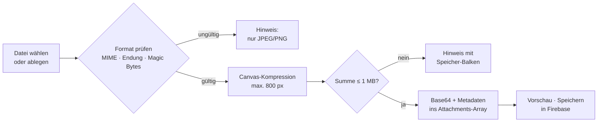

### Datenmodell

```js
task.attachments = [
  {
    name: "Mockup.jpeg",           // Originaler Dateiname
    type: "image/jpeg",            // MIME-Typ
    size: 25432,                   // gespeicherte Bytes (für das 1-MB-Limit)
    base64: "data:image/jpeg;base64,/9j/4AAQ..."
  }
];
```

### Sicherheit

- **Dateisignatur statt nur Endung:** Die ersten Bytes jeder Datei werden auf die JPEG- bzw. PNG-Signatur geprüft.
- **Sichere Anzeige:** Base64-Daten aus der Datenbank werden vor dem Einsetzen als `src` geprüft (`getSafeImageSource`) – manipulierte Einträge können kein HTML oder Skript einschleusen.
- **Dateinamen werden escaped**, bevor sie im HTML erscheinen.
- **Limits im JavaScript**, nicht nur im `accept`-Attribut des Inputs.

<p align="center">
  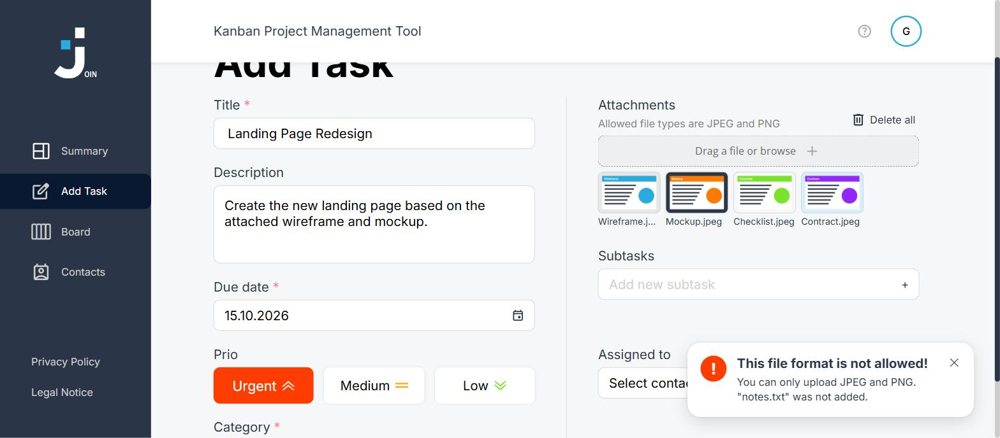<br>
  <sub>Klare Fehlermeldung bei ungültigem Format</sub>
</p>

Der Code des Features liegt gebündelt in [`js/attachments/`](js/attachments/):

| Datei | Aufgabe |
|---|---|
| [`attachment_base64.js`](js/attachments/attachment_base64.js) | Bild laden, auf 800 px skalieren, als Base64 kodieren, Base64 → Blob für Downloads |
| [`attachment_validation.js`](js/attachments/attachment_validation.js) | Format, Signatur, 1-MB-Limit, sichere Bildquelle, Größen-Formatierung |
| [`attachment_picker.js`](js/attachments/attachment_picker.js) | Filepicker, Drag & Drop, Vorschau, Löschen, Fehlermeldungen |
| [`image_viewer.js`](js/attachments/image_viewer.js) | Bildbetrachter mit Blättern, Zoom, Download und Tastatursteuerung |

---

## Weitere Funktionen

- **Login & Registrierung** mit eigener Formularvalidierung (keine Browser-Standardmeldungen)
- **Passwort vergessen:** Reset-Link per E-Mail ([EmailJS](https://www.emailjs.com)), 30 Minuten gültig, nur einmal verwendbar
- **Summary** mit Kennzahlen, dringenden Aufgaben, nächster Deadline und tageszeitabhängiger Begrüßung
- **Board** mit vier Spalten, Drag & Drop (auch per Touch), Suche in Titel und Beschreibung, Subtask-Fortschritt
- **Task-Detail & Bearbeiten** im zweispaltigen Layout – alle Felder inklusive Kategorie und Anhängen änderbar
- **Kontakte** alphabetisch gruppiert, mit Profilfoto, Validierung und Bearbeiten/Löschen
- **Account-Dialog** („My account“ / „Edit account“) mit Profilfoto und *Delete my account* inklusive Sicherheitsabfrage
- **Gastmodus:** Jeder Gast bekommt eine eigene 15-Minuten-Sitzung und ein eigenes Konto. Vor jeder Änderung wird das Original gesichert – nach Ablauf, beim Logout oder beim Schließen der Seite wird alles wiederhergestellt, Daten registrierter Nutzer bleiben unberührt
- **Kein Scrollen im Hintergrund**, solange ein Dialog geöffnet ist (Desktop und Mobil)

---

## Screenshots

<table>
<tr>
<td width="50%">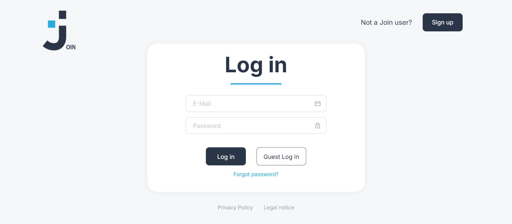</td>
<td width="50%">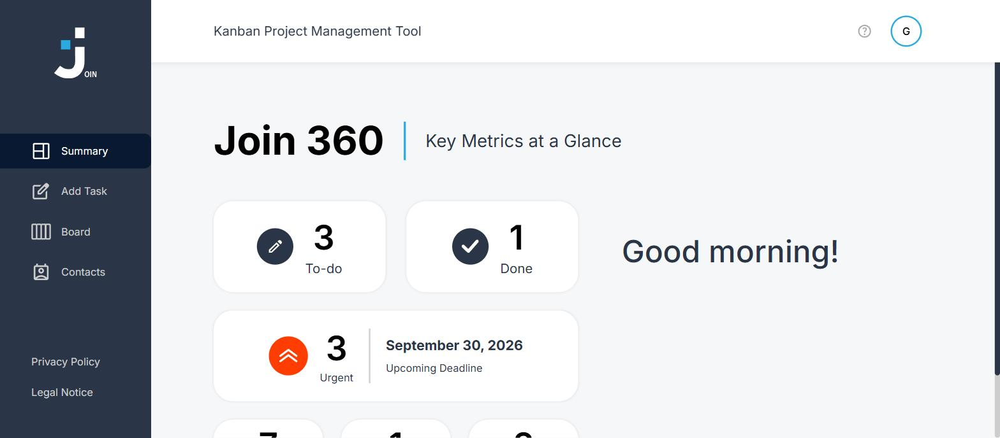</td>
</tr>
<tr>
<td align="center"><sub>Login mit Gast-Login und „Forgot password?“</sub></td>
<td align="center"><sub>Summary mit Kennzahlen</sub></td>
</tr>
<tr>
<td>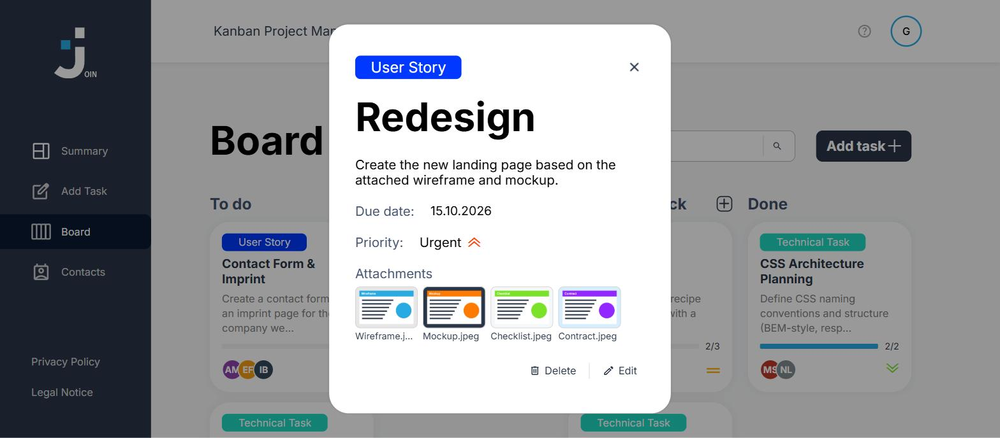</td>
<td>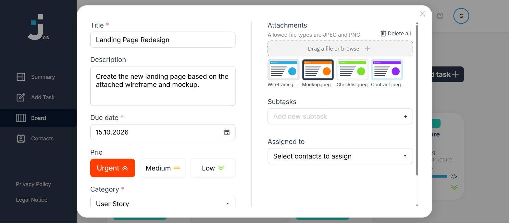</td>
</tr>
<tr>
<td align="center"><sub>Task-Detail mit Anhängen</sub></td>
<td align="center"><sub>Task bearbeiten – Anhänge hinzufügen und löschen</sub></td>
</tr>
<tr>
<td>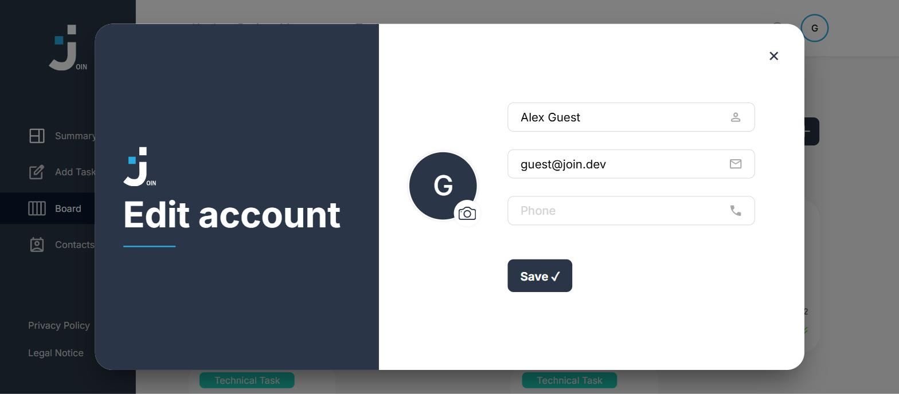</td>
<td>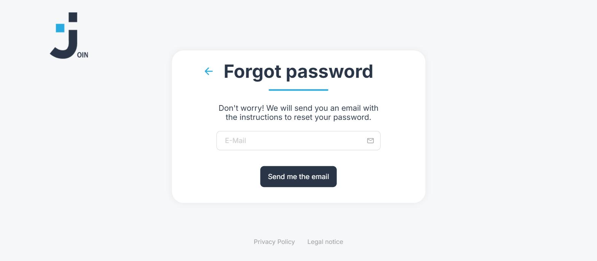</td>
</tr>
<tr>
<td align="center"><sub>Account mit Profilfoto</sub></td>
<td align="center"><sub>Passwort vergessen</sub></td>
</tr>
</table>

---

## Technik & Architektur

| | |
|---|---|
| **Frontend** | HTML5, CSS3, Vanilla JavaScript (ohne Framework, ohne Build-Schritt) |
| **Datenbank** | Firebase Realtime Database über die REST-API |
| **E-Mail** | EmailJS (REST-API) für den Passwort-Reset |
| **Hosting** | Statischer Webspace (FTP) |
| **Design** | Figma „Join Version IHK“ |

```
Join-IHK/
├── index.html · login.html        Einstieg, Login, Registrierung, Passwort vergessen
├── html/                          Summary, Add Task, Board, Kontakte, Hilfe, Rechtliches
├── js/
│   ├── attachments/               ⭐ Dateiupload & Bildbetrachter (Prüfungsfeature)
│   ├── board/                     Board, Drag & Drop, Detail, Bearbeiten
│   ├── task/                      Add-Task-Seite
│   ├── contacts/                  Kontakte
│   ├── profile/                   Account-Dialog, Gast-Konto
│   ├── login/                     Login, Registrierung, Passwort-Reset
│   ├── summary/                   Kennzahlen
│   ├── guest_session.js           15-Minuten-Gastsitzungen mit Rücksetzung
│   └── config.js                  Datenbank- und EmailJS-Konfiguration
├── assets/
│   ├── css/  templates/  icons/  img/  fonts/
│   └── readme/                    Screenshots dieser README
├── firebase-seed.json             Startdaten: 20 Kontakte, 6 Tasks
└── database.rules.json            Datenbankregeln
```

---

## Installation

Kein Build-Schritt nötig – nur ein lokaler Webserver:

```bash
git clone https://github.com/alexlindt-arch/Join-IHK.git
cd Join-IHK

npx serve .                  # oder
python -m http.server 5500   # → http://localhost:5500
```

Alternativ in VS Code mit der Erweiterung **Live Server** `index.html` öffnen.

<details>
<summary><b>Eigene Firebase-Datenbank einrichten</b></summary>

1. In der [Firebase-Konsole](https://console.firebase.google.com) ein Projekt mit **Realtime Database** anlegen.
2. Die Regeln aus [`database.rules.json`](database.rules.json) übernehmen (`firebase deploy --only database`).
3. In [`js/config.js`](js/config.js) `JOIN_DB_URL` auf die eigene Datenbank-URL setzen.
4. Startdaten einspielen:
   ```bash
   curl -X PUT "<JOIN_DB_URL>/.json" -d @firebase-seed.json
   ```
</details>

<details>
<summary><b>Passwort-Reset per E-Mail (EmailJS) einrichten</b></summary>

1. Auf [emailjs.com](https://www.emailjs.com) einen E-Mail-Service (z. B. Gmail) und ein Template anlegen.
2. Das Template bekommt die Variablen `{{to_email}}`, `{{to_name}}` und `{{reset_link}}`.
3. Service-ID, Template-ID und Public Key in `EMAILJS_CONFIG` in [`js/config.js`](js/config.js) eintragen.
</details>

---

## Code-Qualität

- **Clean Code:** jede Funktion hat eine Aufgabe und höchstens 14 Zeilen, jede Datei höchstens 400 Zeilen
- **JSDoc** für jede Funktion
- **camelCase** für Funktionen und Variablen, sprechende Namen
- **Semantisches HTML:** `header`, `nav`, `main`, `section`, `article`, `dialog`; klickbare Elemente sind Buttons oder Links
- **Barrierefreiheit:** Tastaturbedienung, Fokusrahmen, ARIA-Labels, Escape schließt Dialoge
- **Design-Regeln:** keine Schrift unter 16 px (Kleingedrucktes 14 px), Übergänge 100 ms, keine Browser-Standardvalidierung
- **Keine Konsolenausgaben**, eigene Fehlermeldungen für den Nutzer

---

## Autor

**Alexander Lindt** – IHK-Abschlussprojekt „Dateiupload in Join“

[GitHub @alexlindt-arch](https://github.com/alexlindt-arch)
